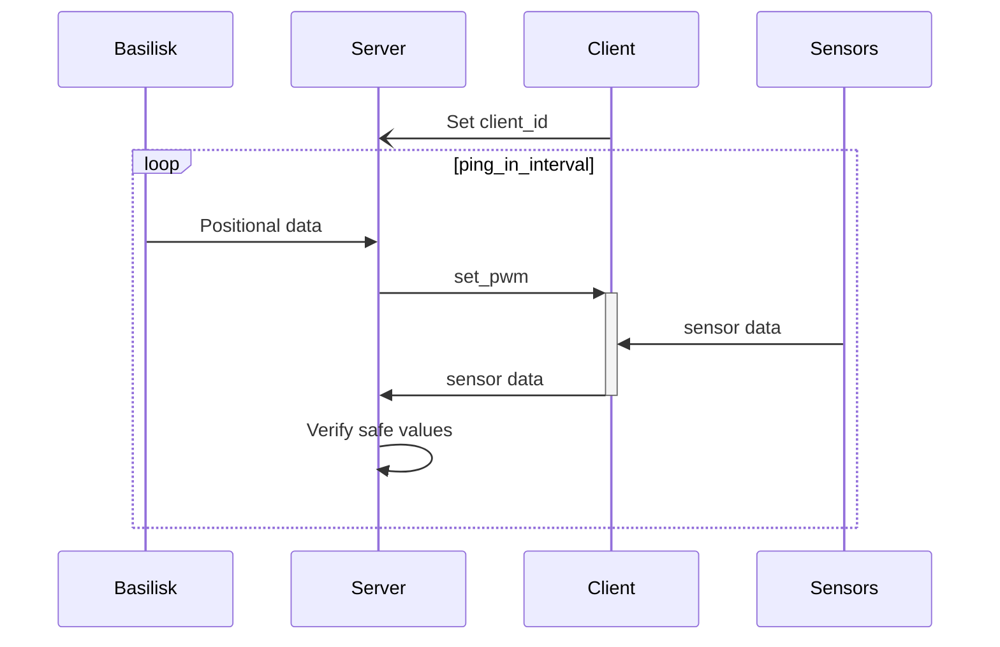

# oresat-solar-simulator

Solar simulator for testing 1U solar panels

## General Information

The OreSat Solar Simulator is a benchtop simulator for hardware-in-the-loop testing of CubeSat solar modules. It uses LED and halogen light bulbs to emit light that simulates the sun's solar spectrum in low Earth orbit (Air Mass 0 or 'AM0').

The work for this was done as an MCECS Capstone Project from January to June of 2023 by Bendjy Faurestal, Adam Martinez, Cesar Ordaz-Coronel, and Charles Nasser. Andrew Greenberg was both representing PSAS as the Industry Sponsor and the Faculty Advisor to the students.

## Hardware

The schematic and pcb layout were designed in [kiCADv7](https://www.kicad.org/download/). The boards we used were fabricated by [OSHPark](https://oshpark.com/) in Lake Oswego, OR.

The simulators are driven by a PocketBeagle Rev. A2b attached to the board.

## Software

The software for this project lives in the [oresat-solar-simulator-software](https://github.com/oresat/oresat-solar-simulator-software) repository.

## Mechanical

The mechanical components were developed by Zeus Ayala using onShape.

## Server-Client Communication

## License

All materials in this repo are copyright Portland State Aerospace Society and are licensed under the CERN Open Hardware Licence Version 2 -
Strongly Reciprocal (CERN-OHL-S v2) and the GNU General Public License v3.0, or any later versions. A copy of the license is located in [here](LICENSE.md).
